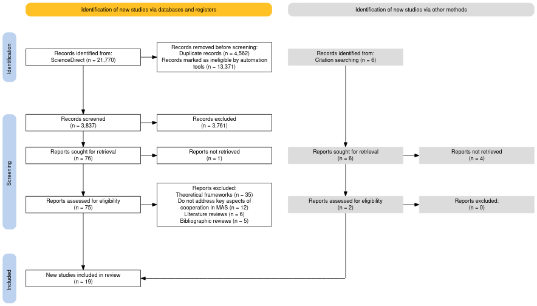
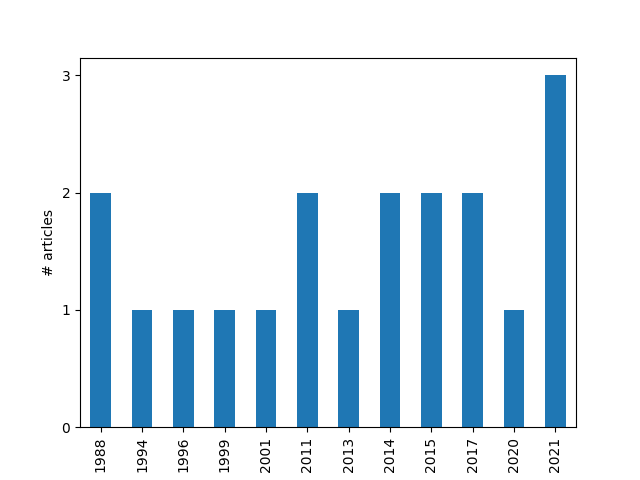
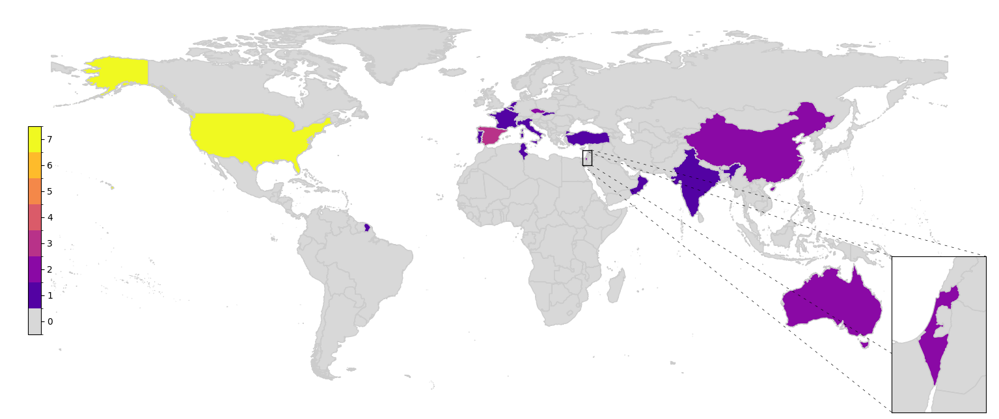
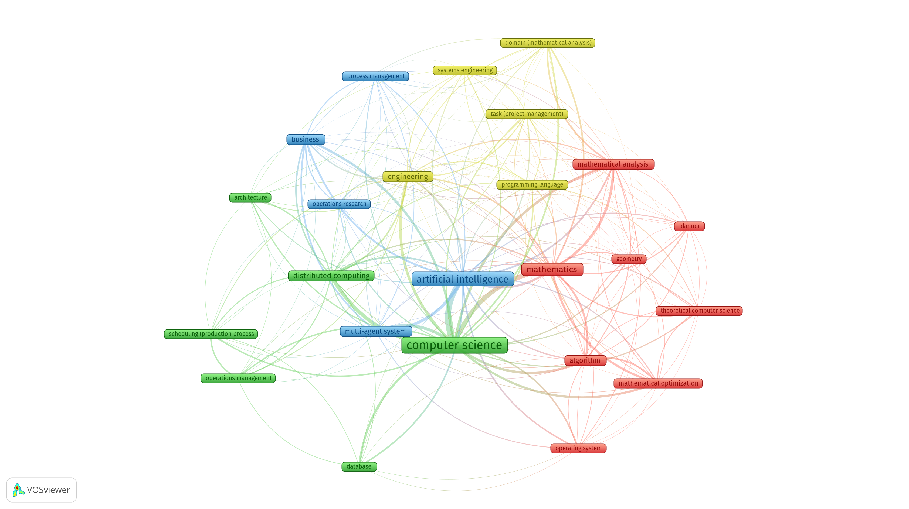

## Разрешение конфликтов и кооперативное планирование в мультиагентных системах

Матюхин Г.В. <a href="contact@gmatiukhin.site">contact@gmatiukhin.site</a> 
Виноградов А.Н. <a href="vinogradov-an@rudn.ru">vinogradov-an@rudn.ru</a> 

---

<!-- _header: Цели работы -->

1. **Анализ моделей**
   Изучить распространённые подходы к моделированию мультиагентных систем (MAS).
1. **Разрешение конфликтов**
   Исследовать стратегии координации и устранения конфликтов между агентами.
1. **Кооперация агентов**
   Рассмотреть механизмы взаимодействия и совместного принятия решений.
1. **Оценка эффективности**
   Оценить сильные и слабые стороны существующих методологий MAS.

---

<!-- _header: Стратегия поиска -->

Использованные поисковые запросы:

- `multi-agent systems AND conflict solving`
- `cooperated planning AND conflict solving`
- `multi-agent systems AND cooperated planning`
- `multi-agent systems AND (cooperated planning OR conflict solving)`

---

<!-- _header: Отбор источников -->

---

<!-- _header: Анализ временного распределения -->

---

<!-- _header: Географическое распределение публикаций -->

---

<!-- _header: Определение текущих тенденций -->

---

<!-- _header: Моделирование проблемы -->

- Домены формализуются через графы ограничений, иерархии и blackboard-архитектуры.
- Используются модели удовлетворения ограничений для автономного и согласованного планирования.
- Состояния и цели описываются переходами, полезностью и вероятностными моделями.
- Учитываются временные и динамичные аспекты среды, применяются инкрементальные методы.

---

<!-- _header: Разрешение конфликтов -->

- Удовлетворение и расслабление ограничений: добавление/ослабление ограничений для разрешения конфликтов.
- Переговоры и торги: распределение задач через аукционы и динамические пересмотры соглашений.
- Аргументация: структурированные диалоги и мета-рассуждение для согласования решений.

---

<!-- _header: Механизмы кооперации -->

- Децентрализованный контроль: агенты действуют независимо, используя коммуникационные протоколы.
- Иерархии и декомпозиция: задачи разбиваются на подзадачи, упрощается координация и масштабирование.
- Адаптация: обратная связь и итеративное обновление планов повышают устойчивость.

---

<!-- _header: Оценка эффективности -->

- Ограничения и полезность: эффективны в формализованных доменах, но требуют адаптации к динамике.
- Переговоры: гибкие, но зависят от качества связи.
- Аргументация: обеспечивает прозрачность, но ресурсоемка.
- Кооперативные механизмы: масштабируемы и отказоустойчивы, но требуют сложной координации.
- Адаптивные методы: эффективны при изменениях, но чувствительны к качеству обратной связи.

---

Спасибо за внимание
